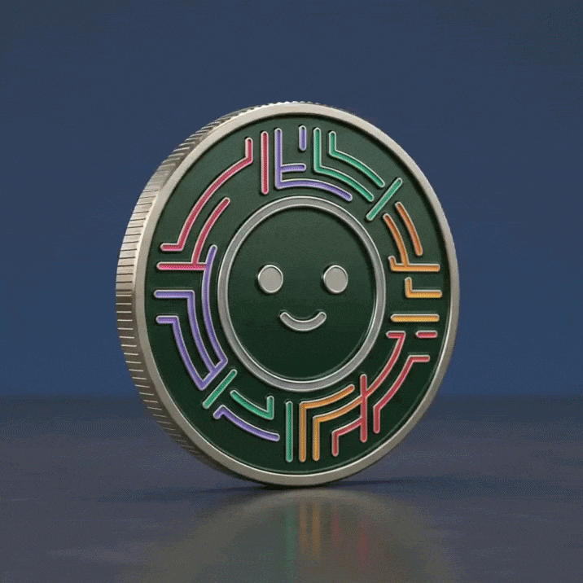
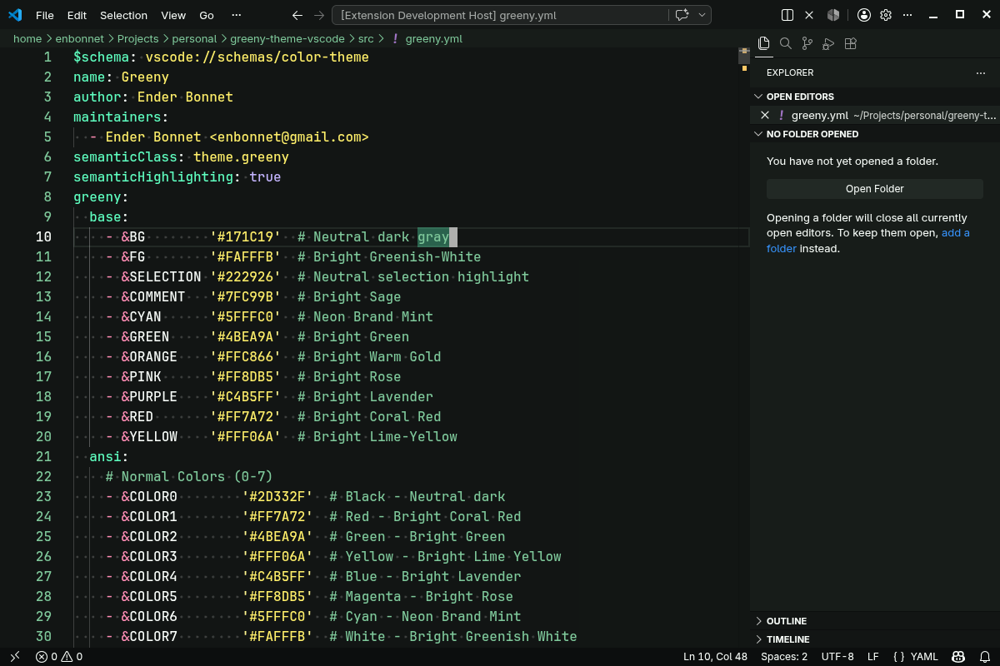
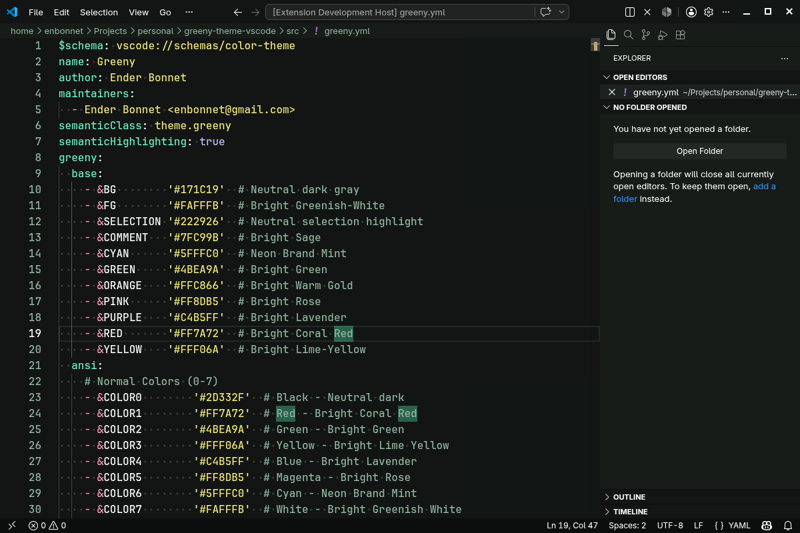

<div align="center">
<h1>Green Night Theme for Visual Studio Code</h1>

[](https://marketplace.visualstudio.com/items?itemName=enbonnet.green-night-theme)
[](https://open-vsx.org/extension/enBonnet/green-night-theme)
[](https://marketplace.visualstudio.com/items?itemName=enbonnet.green-night-theme)


</div>

## Table of Contents

- [Features](#features)
- [Preview](#preview)
- [Installation](#installation)
- [Using the Theme](#using-the-theme)
- [Color Palette](#color-palette)
- [Supported Languages](#supported-languages)
- [Development](#development)
- [Related Projects](#related-projects)
- [Contributing](#contributing)
- [License](#license)
- [Credits](#credits)

## Features

- Dark theme with bright greenish accents
- Optimized for long coding sessions
- Two variants: **Standard** (vibrant) and **Soft** (desaturated)
- Explicit scoping for 30+ languages and dialects
- Semantic highlighting support

## Description

This is the Green Night Theme for Visual Studio Code.

## Preview

### Base Theme
<div align="center">

</div>

### Soft Variant
<div align="center">

</div>

## Color Palette

| Role | Color | Hex | Preview |
|------|-------|-----|---------|
| Background | Neutral dark gray | `#171C19` |  |
| Foreground | Bright Greenish-White | `#FAFFFB` |  |
| Selection | Neutral selection | `#222926` |  |
| Comments | Bright Sage | `#7FC99B` |  |
| Cyan | Neon Brand Mint | `#5FFFC0` |  |
| Green | Bright Green | `#4BEA9A` |  |
| Orange | Bright Warm Gold | `#FFC866` |  |
| Pink | Bright Rose | `#FF8DB5` |  |
| Purple | Bright Lavender | `#C4B5FF` |  |
| Red | Bright Coral Red | `#FF7A72` |  |
| Yellow | Bright Lime-Yellow | `#FFF06A` |  |

### UI Variants

| Variable | Hex | Purpose |
|----------|-----|---------|
| BGDarker | `#0C0F0E` | Darkest panels |
| BGDark | `#121614` | Dark sidebars/status bar |
| BG | `#171C19` | Main editor background |
| BGLight | `#1A201D` | Mid-tone neutral |
| BGLighter | `#222926` | Hover states/highlights |

### ANSI Terminal Colors

| ANSI | Name | Normal | Bright |
|------|------|--------|--------|
| 0/8 | Black | `#2D332F` | `#7FC99B` |
| 1/9 | Red | `#FF7A72` | `#FF9A92` |
| 2/10 | Green | `#4BEA9A` | `#6DFFC9` |
| 3/11 | Yellow | `#FFF06A` | `#FFF58F` |
| 4/12 | Blue | `#C4B5FF` | `#D5CAFF` |
| 5/13 | Magenta | `#FF8DB5` | `#FFA9C8` |
| 6/14 | Cyan | `#5FFFC0` | `#8BFFE2` |
| 7/15 | White | `#FAFFFB` | `#FFFFFF` |

## Supported Languages

This theme includes explicit scoping fixes for the following languages and dialects:

| Language | Scoping | Language | Scoping |
|----------|---------|----------|---------|
| JavaScript (JS) | `variable.other.constant.js` | TypeScript (TS) | `variable.other.constant.ts` |
| JSX | `variable.other.constant.js`, `support.class.component.jsx` | TSX | `variable.other.constant.tsx`, `support.class.component.tsx` |
| C | `storage.type.c` | C++ | generic |
| C# | `keyword.type.cs`, `storage.type.cs` | Go | `source.go storage.type` |
| Java | `source.java storage.type` | Groovy | `source.groovy storage.type` |
| Kotlin | `storage.type.kotlin` | Scala | `storage.type.scala` |
| Dart | `storage.type.dart` | Swift | `storage.type.attribute.swift` |
| ObjC | `storage.type.objc` | PHP | `storage.type.php` |
| Python | docstrings | Ruby | `variable.other.readwrite.instance.ruby` |
| Rust | `storage.class.std.rust`, `storage.type.core.rust` | Haskell | `storage.type.haskell` |
| OCaml | `storage.type.ocaml` | Elixir | `storage.type.elixir` |
| Lua | `support.function.any-method.lua` | Perl | `constant.other.key.perl` |
| Shell | `source.shell variable.other` | PowerShell | `source.powershell` |
| SCSS | `meta.attribute-selector.scss` | CSS | `punctuation.separator.list.comma.css` |
| YAML | `entity.name.tag.yaml` | TOML | `entity.name.section.toml` |
| GraphQL | `entity.name.fragment.graphql` | Markdown | `markup.heading.markdown` |
| Makefile | `meta.scope.prerequisites.makefile` | CoffeeScript | `meta.variable.assignment.destructured.object.coffee` |
| Vue | `punctuation.section.embedded.begin.vue` | Svelte | `punctuation.section.embedded.begin.svelte` |
| Terraform/HCL | `storage.type.hcl` | Prisma | `storage.type.prisma` |

Additional languages (R, SQL, Dockerfile, JSON, XML, etc.) are covered by the general purpose scoping rules.

## Installation

### VS Code Marketplace
[](https://marketplace.visualstudio.com/items?itemName=enbonnet.green-night-theme)

### Open VSX Registry
[](https://open-vsx.org/extension/enBonnet/green-night-theme)

## Using the Theme

1. Open the Command Palette (`Ctrl+Shift+P` or `Cmd+Shift+P`)
2. Type "Preferences: Color Theme" and press Enter
3. Search for "Green Night Theme"
4. Select either "Green Night Theme" or "Green Night Theme Soft" from the list

### Recommended Settings

For the best experience, add these to your `settings.json`:

```json
{
  "workbench.colorTheme": "Green Night Theme",
  "editor.fontFamily": "'Victor Mono', Monaco, Menlo, 'Courier New', monospace",
  "editor.fontSize": 16,
  "editor.lineHeight": 1.5,
  "editor.fontWeight": "600",
  "editor.wordWrap": "on"
}
```

- [Victor Mono](https://rubjo.github.io/victor-mono/)

## Theme Variants

- **Green Night Theme** — Vibrant, high-contrast version
- **Green Night Theme Soft** — Desaturated version for reduced eye strain

## Development

### Prerequisites

- [Node.js](https://nodejs.org/) (v18+)
- [pnpm](https://pnpm.io/) or npm

### Setup

```bash
# Install dependencies
pnpm install

# Build the theme
pnpm run build

# Package the extension
pnpm run package
```

### Project Structure

```
├── src/
│   └── green-night.yml      # Theme source file (YAML)
├── theme/
│   ├── green-night.json     # Generated theme
│   └── green-night-soft.json
├── scripts/
│   ├── build.js          # Build script
│   └── generate.js       # Theme generator
└── images/
    └── icon.png          # Extension icon
```

## Contributing

Contributions are welcome! If you find any issues or have suggestions for improvements, please feel free to:

1. Open an [issue](https://github.com/enbonnet/green-night-theme-vscode/issues)
2. Submit a pull request
3. Share your feedback

## Stay Updated

For updates, star this repository and follow me on [GitHub](https://github.com/enbonnet).

## Related Projects

- [Green Night Theme for Ghostty](https://github.com/enBonnet/green-night-theme-ghostty) — The same color palette, adapted for the Ghostty terminal emulator

## Credits

- Inspired by the green color palette
- Based on the [Dracula Theme](https://draculatheme.com/) schema, with colors adapted from the green color palette
- Thanks to all contributors who help improve this theme

## License

This project is licensed under the MIT License - see the [LICENSE](LICENSE) file for details.

---

<div align="center">
Made by <a href="https://enbonnet.com">Ender Bonnet</a>
</div>
